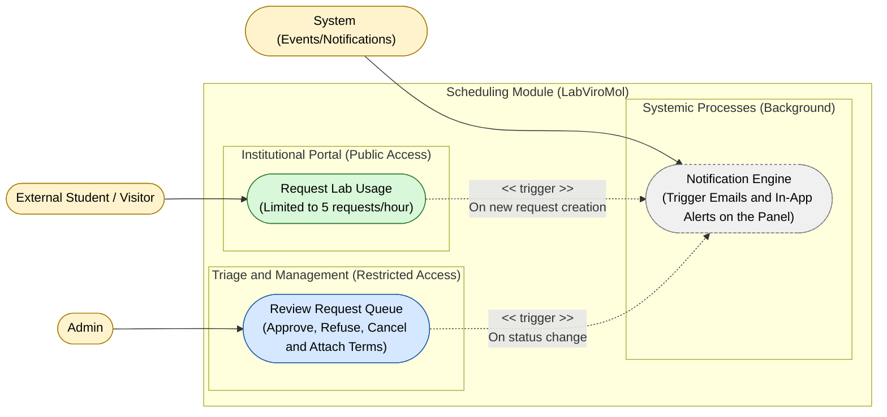

# Use Case Diagram — Scheduling Module

**English** · [Português](./use-case-diagram.pt-BR.md)

This document presents the use case diagram specific to the **Scheduling** module. It covers lab-usage scheduling, grouped into 3 capabilities: public request
(limited to 5 requests/hour), triage and management by the Admin (approve, refuse,
cancel, attach terms) and the systemic notification engine triggered on every status
change. The actors interacting with this module are **Admin**, **External Student / Visitor**
and **System**.

**Cross-module relations:**
- `Review Request Queue` depends on `Identity.Log In / Log Out`
 (authentication) — see the Context Map (`context-map.md`) for the integration mechanism.
- `Notification Engine` depends on `Notify.Process Domain Events` — see the Context
 Map (`context-map.md`) for the integration mechanism.
