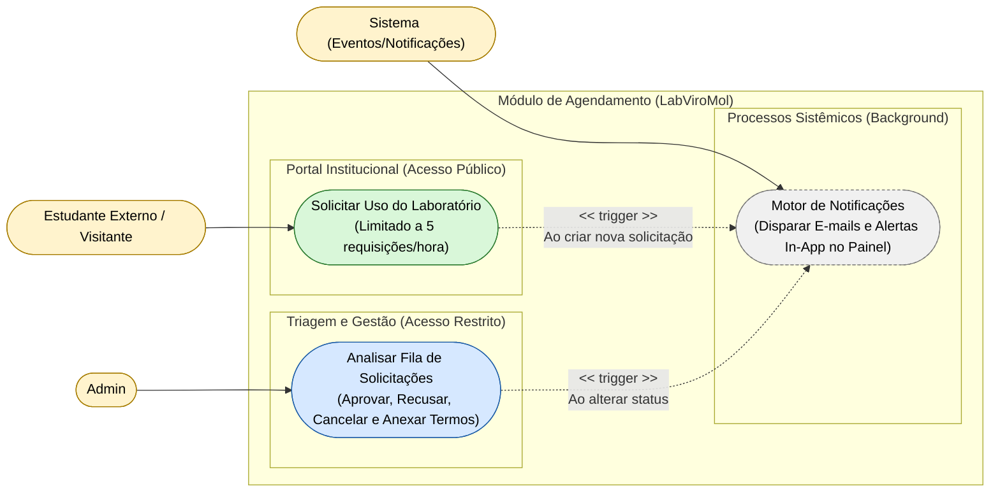

# Diagrama de Casos de Uso — Módulo Scheduling

[English](./use-case-diagram.md) · **Português**

Este documento apresenta o diagrama de casos de uso específico do módulo **Scheduling**. Cobre o agendamento de uso do laboratório, agrupado em 3 capacidades: solicitação
pública (limitada a 5 requisições/hora), triagem e gestão pelo Admin (aprovar, recusar,
cancelar, anexar termos) e o motor de notificações sistêmico disparado a cada mudança de
status. Interagem com este módulo os atores **Admin**, **Estudante Externo / Visitante** e
**Sistema**.

**Relações cross-módulo:**
- `Analisar Fila de Solicitações` depende de `Identity.Realizar Login / Logout`
 (autenticação) — ver Mapa de Contexto (`context-map.md`) para o mecanismo de integração.
- `Motor de Notificações` depende de `Notify.Processar Eventos de Domínio` — ver Mapa de
 Contexto (`context-map.md`) para o mecanismo de integração.
