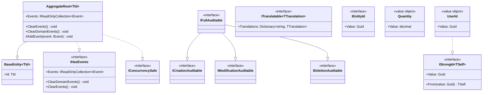

# Class Diagram — Shared Kernel

**English** · [Português](./class-diagram.pt-BR.md)

This document presents the class diagram of the **Shared Kernel**. It covers the
base classes and interfaces from which the domain of all 6 LabViroMol modules
inherits or implements.

