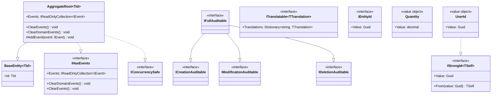

# Diagrama de Classes — Shared Kernel

[English](./class-diagram.md) · **Português**

Este documento apresenta o diagrama de classes do **Shared Kernel**. Cobre as
classes e interfaces base de onde todo o domínio dos 6 módulos do LabViroMol herda ou
implementa.

